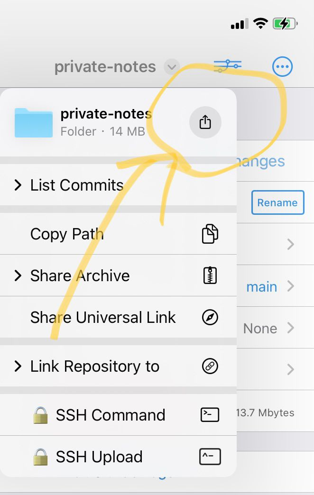
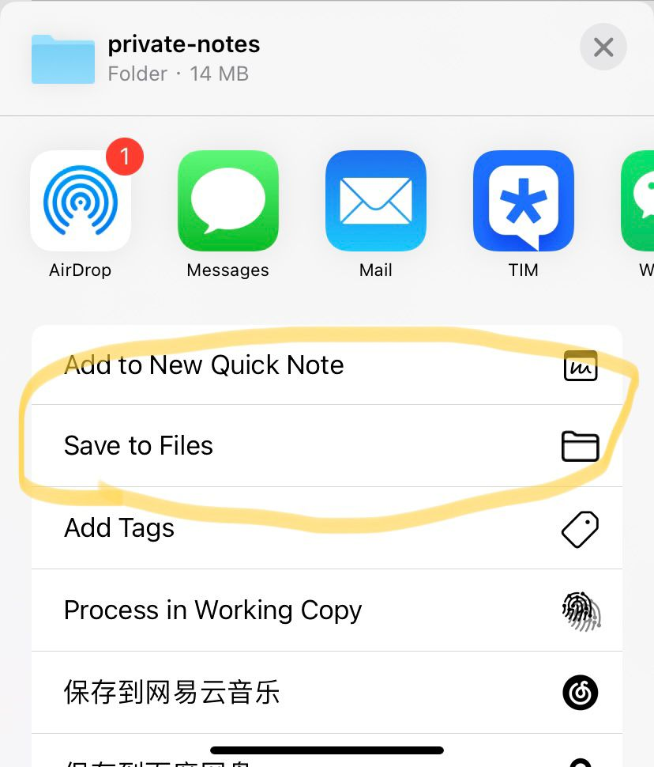

[通过working copy](https://forum.obsidian.md/t/mobile-setting-up-ios-git-based-syncing-with-mobile-app-using-working-copy/16499)

phone上同步需要手动save一下，pc上git push后，iphone上working copy 应用上git pull下来，然后save到obsidian上

